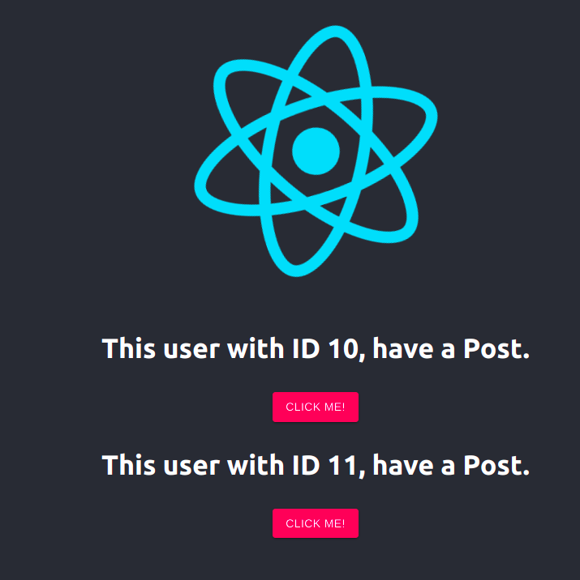

# Hello Latchel Member!

## This is my solution and feedback about the old code

When analyzing the code, it was found that it was better to make this little app in an orderly way and with good practices such as:

1. Divide into 2 folders, front-end and back-end
2. On the front-end you will find the code in React and Back-end Laravel.
3. Both folders were docker to be able to be lifted by any operating system
4. A docker-compose was made to lift the application
5. I put 2 images, mysql and an adminer (database viewer)

The laravel API contains the migrations and the seeders to populate the database.

Steps to raise the app:

1. Install [ Docker Engine ](https://docs.docker.com/engine/install/) :fire:
2. Go to the root of the project and run => `docker-compose build`
3. Go to the root of the project and run => `docker-compose up -d`
4. Then execute for populate DB `docker exec -it laravel sh`, `php artisan migrate`, `php artisan db:seed --class=PostSeeder
5. Visit the [ App ](http://127.0.0.1:3000/)
6. Visit the [ Adminer ](http://127.0.0.1:8080/), credentials: Server = mysql, user = root, password = root and database = latchel
7. I hope it make sense to you guys!.
   `
   

## P.S

-   The old code persist with comments about what i could see is wrong and you maybe feel overwhelmed 'cause 129 files with changes, it is generate when created 2 app, react & laravel with the official created commands.
